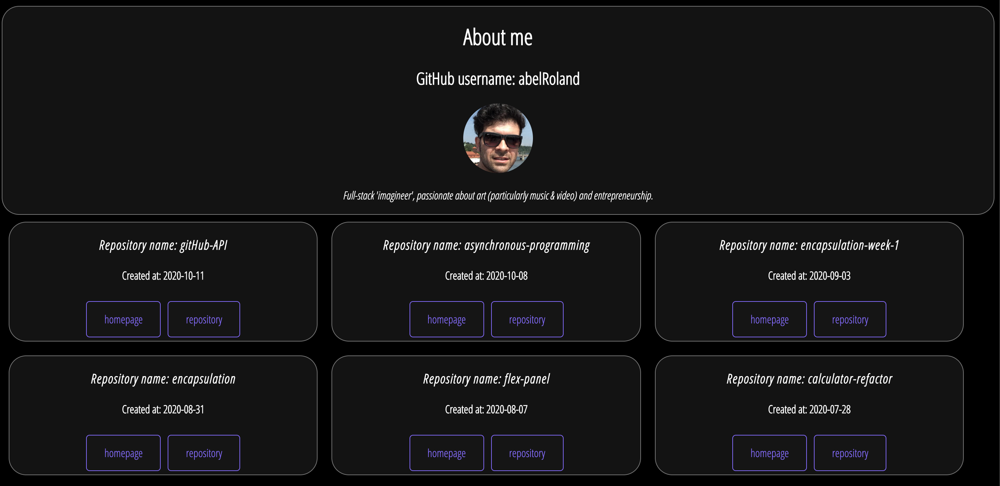

# Project: GitHub Portfolio

- [Demo](https://abelroland.github.io/gitHub-API)

## Table of Contents

- [About the Project](#about-the-project)
- [License](#license)

## About The Project

The main idea of this project is to practice and understand the concepts of asynchronous programming, using `Classes` and `Promises` with `REST API`.

### Built With

- [Visual studio code](https://code.visualstudio.com/)
- [GitHub](https://github.com)
- [JavaScript](https://www.javascript.com/)
- [GitHub API](https://docs.github.com/en/free-pro-team@latest/rest)

<!-- LICENSE -->

## License

Distributed under the MIT License. See [LICENSE](https://github.com/abelRoland/gitHub-API/blob/master/LICENSE) for more information.
